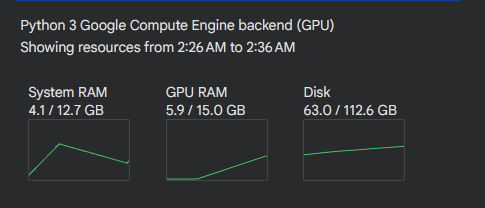
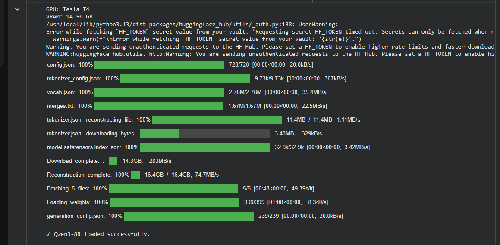
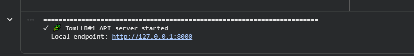
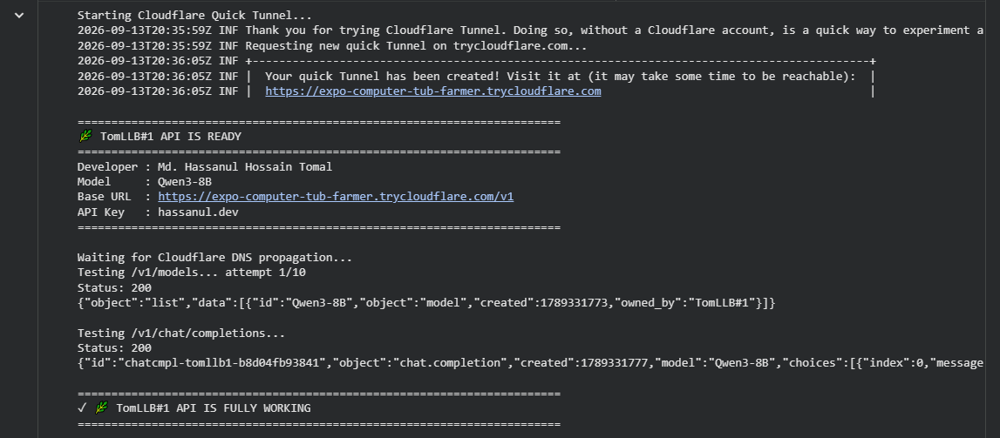
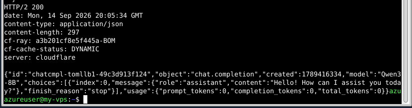

# 🌿 TomLLB#1 — Qwen3-8B OpenAI-Compatible API

> **Run Qwen3-8B on a Google Colab NVIDIA T4 using 4-bit NF4 quantization and expose it as a temporary OpenAI-compatible API through Cloudflare Quick Tunnel.**

<p align="center">

**Qwen3-8B · Google Colab · NVIDIA T4 · 4-bit NF4 · FastAPI · Cloudflare Tunnel**

</p>

---

## 📌 Overview

**TomLLB#1** is a lightweight experimental LLM deployment project that runs **Qwen3-8B** on a Google Colab **NVIDIA T4 GPU** using **4-bit NF4 quantization**.

The model is loaded with Hugging Face Transformers and `bitsandbytes`, then served through a custom **FastAPI** server that provides an **OpenAI-compatible API**.

A temporary **Cloudflare Quick Tunnel** exposes the local FastAPI server through a public HTTPS URL, allowing external applications and AI agents to communicate with the model remotely while the Google Colab runtime remains active.

### What this project provides

* 🧠 Qwen3-8B inference
* ⚡ 4-bit NF4 quantization
* 🎮 NVIDIA T4 GPU support
* 🔌 OpenAI-compatible API
* 🔐 Bearer API-key authentication
* 🌐 Temporary public HTTPS endpoint
* 📡 Streaming and non-streaming responses
* 🤖 External AI-agent integration
* 🧪 Simple API testing workflow

---

## ✨ Project Highlights

| Component            | Implementation            |
| -------------------- | ------------------------- |
| Language Model       | Qwen3-8B                  |
| GPU                  | NVIDIA T4                 |
| Runtime              | Google Colab              |
| Quantization         | 4-bit NF4                 |
| Compute Type         | FP16                      |
| Model Framework      | Hugging Face Transformers |
| Quantization Library | bitsandbytes              |
| API Framework        | FastAPI                   |
| ASGI Server          | Uvicorn                   |
| Public Tunnel        | Cloudflare Quick Tunnel   |
| API Format           | OpenAI-compatible         |
| Authentication       | Bearer API Key            |
| Streaming            | OpenAI-style SSE          |
| Main Endpoint        | `/v1/chat/completions`    |

---

# 🏗️ Architecture

The project follows this workflow:

```text
┌──────────────────────────────┐
│       Google Colab           │
│                              │
│      NVIDIA T4 GPU           │
│             │                │
│             ▼                │
│       Qwen3-8B               │
│             │                │
│      4-bit NF4               │
│      Quantization            │
│             │                │
│             ▼                │
│      Transformers            │
│       Inference              │
│             │                │
│             ▼                │
│       FastAPI Server         │
│             │                │
│       OpenAI-Compatible      │
│             │                │
└─────────────┼────────────────┘
              │
              ▼
     Cloudflare Quick Tunnel
              │
              ▼
      Temporary HTTPS URL
              │
        ┌─────┴─────┐
        ▼           ▼
    AI Agent    API Client
```

### Request flow

```text
Client / AI Agent
       │
       │ HTTPS
       ▼
Cloudflare Quick Tunnel
       │
       │ HTTP
       ▼
FastAPI :8000
       │
       ▼
Qwen3-8B
       │
       ▼
Generated Response
       │
       ▼
Client / AI Agent
```

---

# 🚀 Getting Started

## 1. Open the Google Colab Notebook

Upload or open the included notebook:

```text
TomLLB1-Qwen3-8B-OpenAI-API-T4.ipynb
```

The notebook is designed to run inside a Google Colab GPU runtime.

Google Colab notebooks can also be loaded directly from GitHub. Google notes that the notebook's code, text, outputs, and comments can be shared, while the underlying temporary virtual machine and installed runtime environment are not shared.

---

## 2. Enable the T4 GPU

In Google Colab:

```text
Runtime
   ↓
Change runtime type
   ↓
Hardware accelerator
   ↓
GPU
```

Select an available **NVIDIA T4** runtime.

The notebook itself checks whether CUDA is available and stops with an error if a GPU is not detected.

```python
if not torch.cuda.is_available():
    raise RuntimeError(
        "No GPU detected. Select Runtime → Change runtime type → T4 GPU."
    )
```

> [!NOTE]
> Google Colab hardware availability can vary by account, plan, region, and current capacity. The notebook requires a GPU runtime capable of loading the selected model.

---

# 📦 Installation

The notebook installs the required Python packages automatically.

```bash
pip install -U transformers accelerate bitsandbytes fastapi uvicorn requests
```

It also downloads the Cloudflare `cloudflared` binary:

```bash
wget -q \
  https://github.com/cloudflare/cloudflared/releases/latest/download/cloudflared-linux-amd64 \
  -O /usr/local/bin/cloudflared
```

Then makes it executable:

```bash
chmod +x /usr/local/bin/cloudflared
```

### Main dependencies

| Package        | Purpose                      |
| -------------- | ---------------------------- |
| `transformers` | Loading and running Qwen3-8B |
| `accelerate`   | Model/device management      |
| `bitsandbytes` | 4-bit quantization           |
| `fastapi`      | API server                   |
| `uvicorn`      | ASGI server                  |
| `requests`     | API testing                  |
| `cloudflared`  | Public HTTPS tunnel          |

---

# 🧠 Model Loading

The project uses:

```text
Qwen/Qwen3-8B
```

The model is loaded using Hugging Face Transformers.

To make the model practical for a T4 GPU, the notebook uses **4-bit NF4 quantization**.

```python
quant_config = BitsAndBytesConfig(
    load_in_4bit=True,
    bnb_4bit_quant_type="nf4",
    bnb_4bit_compute_dtype=torch.float16,
    bnb_4bit_use_double_quant=True,
)
```

The model is then loaded with:

```python
model = AutoModelForCausalLM.from_pretrained(
    MODEL_NAME,
    quantization_config=quant_config,
    device_map="auto",
)
```

The tokenizer is loaded using:

```python
tokenizer = AutoTokenizer.from_pretrained(MODEL_NAME)
```

Finally:

```python
model.eval()
```

puts the model into evaluation mode.

---

# ⚙️ Quantization Configuration

| Setting             | Value           |
| ------------------- | --------------- |
| Quantization        | 4-bit           |
| Quantization Type   | NF4             |
| Compute Dtype       | `torch.float16` |
| Double Quantization | Enabled         |
| Device Mapping      | `auto`          |

### Why 4-bit?

An 8B-parameter model can require significant GPU memory when loaded at higher precision.

4-bit quantization reduces the memory required for model weights and makes experimentation with Qwen3-8B more practical on a T4-class Colab runtime.

---

# 🌐 FastAPI Server

After the model is loaded, TomLLB#1 creates a FastAPI application.

```python
app = FastAPI(
    title=f"{BRAND_NAME} API",
    version="1.0.0"
)
```

The server listens on:

```text
127.0.0.1:8000
```

The API is then exposed publicly using Cloudflare Quick Tunnel.

---

# 🔌 API Endpoints

## Health Check

```http
GET /health
```

Example response:

```json
{
  "status": "ok",
  "brand": "TomLLB#1",
  "model": "Qwen3-8B"
}
```

---

## List Models

```http
GET /v1/models
```

Authentication is required.

Example:

```bash
curl \
  -H "Authorization: Bearer YOUR_API_KEY" \
  https://YOUR-URL.trycloudflare.com/v1/models
```

Example response:

```json
{
  "object": "list",
  "data": [
    {
      "id": "Qwen3-8B",
      "object": "model",
      "created": 0,
      "owned_by": "TomLLB#1"
    }
  ]
}
```

---

# 💬 Chat Completions

The primary endpoint is:

```http
POST /v1/chat/completions
```

It follows the general OpenAI chat-completion request structure.

### Supported parameters

| Parameter     | Type    |    Default | Description               |
| ------------- | ------- | ---------: | ------------------------- |
| `model`       | string  | `Qwen3-8B` | Model identifier          |
| `messages`    | array   |   required | Chat messages             |
| `max_tokens`  | integer |      `512` | Maximum generated tokens  |
| `temperature` | float   |      `0.7` | Generation randomness     |
| `top_p`       | float   |      `0.9` | Nucleus sampling          |
| `stream`      | boolean |    `false` | Enable streaming response |

The notebook validates:

```text
max_tokens: 1 – 4096
temperature: 0.0 – 2.0
top_p: 0.0 – 1.0
```

---

# 🔐 API Authentication

The API uses Bearer-token authentication.

Every protected request must include:

```http
Authorization: Bearer YOUR_API_KEY
```

Example:

```bash
-H "Authorization: Bearer YOUR_API_KEY"
```

The API validates the key before allowing access to:

```text
/v1/models
/v1/chat/completions
```

> [!WARNING]
> Never publish a real API key in a public GitHub repository. The current notebook contains a demonstration key configuration; for a public repository, replace it with an environment variable or generate a key dynamically before using the endpoint publicly.

---

# 🌍 Cloudflare Quick Tunnel

TomLLB#1 uses `cloudflared` to expose the local FastAPI server.

The notebook starts:

```bash
cloudflared tunnel \
  --url http://127.0.0.1:8000 \
  --no-autoupdate
```

Cloudflare then provides a temporary HTTPS address similar to:

```text
https://random-name.trycloudflare.com
```

The notebook automatically detects this URL and creates:

```text
https://random-name.trycloudflare.com/v1
```

as the API base URL.

---

# 🔗 API Connection

Once the tunnel is running, the notebook displays:

```text
============================================================
🌿 TomLLB#1 API IS READY
============================================================
Developer : Md. Hassanul Hossain Tomal
Model     : Qwen3-8B
Base URL  : https://YOUR-URL.trycloudflare.com/v1
API Key   : YOUR_API_KEY
============================================================
```

> [!IMPORTANT]
> The public URL belongs to the temporary Cloudflare Quick Tunnel and may change when the tunnel or Colab runtime is restarted.

---

# 🧪 API Testing

The notebook automatically tests the API after starting the tunnel.

## Test `/v1/models`

```python
headers = {
    "Authorization": f"Bearer {API_KEY}"
}

r = requests.get(
    base_url + "/models",
    headers=headers,
    timeout=30
)
```

---

## Test `/v1/chat/completions`

The notebook sends:

```json
{
  "model": "Qwen3-8B",
  "messages": [
    {
      "role": "user",
      "content": "Reply with exactly: TOMLLB API IS WORKING"
    }
  ],
  "max_tokens": 50,
  "temperature": 0.2,
  "stream": false
}
```

A successful response returns HTTP:

```text
200
```

and the notebook reports:

```text
✓ API test passed.
```

---

# 🐍 Python Client Example

Because the API follows an OpenAI-compatible structure, it can be accessed using the OpenAI Python client.

```python
from openai import OpenAI

client = OpenAI(
    base_url="https://YOUR-URL.trycloudflare.com/v1",
    api_key="YOUR_API_KEY",
)

response = client.chat.completions.create(
    model="Qwen3-8B",
    messages=[
        {
            "role": "user",
            "content": "Hello!"
        }
    ],
)

print(response.choices[0].message.content)
```

---

# 💻 cURL Example

```bash
curl -X POST \
  "https://YOUR-URL.trycloudflare.com/v1/chat/completions" \
  -H "Content-Type: application/json" \
  -H "Authorization: Bearer YOUR_API_KEY" \
  -d '{
    "model": "Qwen3-8B",
    "messages": [
      {
        "role": "user",
        "content": "Hello!"
      }
    ],
    "max_tokens": 200,
    "temperature": 0.7
  }'
```

---

# 📡 Streaming Support

TomLLB#1 accepts both:

```json
{
  "stream": false
}
```

and:

```json
{
  "stream": true
}
```

When streaming is requested, the API returns **OpenAI-style Server-Sent Events (SSE)**.

Example:

```text
data: {"id":"...","object":"chat.completion.chunk",...}

data: {"id":"...","object":"chat.completion.chunk",...}

data: [DONE]
```

### Implementation note

The current implementation generates the model response first and then emits the generated text in chunks for compatibility with clients expecting an SSE streaming interface.

Therefore, `stream=true` provides a streaming-compatible response format, but it is **not token-by-token generation from the model itself**.

---

# 🤖 AI Agent Integration

One of the main purposes of this project is to make the Colab-hosted model usable by an external AI agent or application.

The integration pattern is:

```text
┌─────────────────┐
│    AI Agent     │
└────────┬────────┘
         │
         │ OpenAI-compatible request
         ▼
┌─────────────────┐
│ Public HTTPS URL│
└────────┬────────┘
         │
         ▼
┌─────────────────┐
│ Cloudflare      │
│ Quick Tunnel    │
└────────┬────────┘
         │
         ▼
┌─────────────────┐
│ FastAPI         │
│ TomLLB#1        │
└────────┬────────┘
         │
         ▼
┌─────────────────┐
│ Qwen3-8B        │
│ NVIDIA T4       │
└─────────────────┘
```

This allows an external client to treat the Colab-hosted model as a remote LLM backend.

---

# 📸 Screenshots

> Add your screenshots to the `screenshots/` directory and keep the filenames below.

## 1. Google Colab T4 Runtime

Shows the notebook running with an NVIDIA T4 GPU.



---

## 2. Qwen3-8B Model Loaded

Shows the successful model loading and detected GPU/VRAM information.



---

## 3. API Ready

Shows the generated Cloudflare public URL and TomLLB#1 API information.



---

## 4. API Test

Shows successful `/v1/models` and `/v1/chat/completions` requests.



---

## 5. External Agent Connection

Shows an external AI agent or application communicating with TomLLB#1.



---

# 📁 Repository Structure

```text
tomllb1-qwen3-8b-api/
│
├── Qwen3-8B-OpenAI-API-T4.ipynb
│
├── screenshots/
│   ├── colab-t4-runtime.png
│   ├── qwen3-model-loaded.png
│   ├── api-ready.png
│   ├── api-test.png
│   └── agent-integration.png
│
└── README.md
```

The repository intentionally keeps the deployment simple because the primary implementation is contained in the Jupyter/Colab notebook.

---

# 🧩 Notebook Workflow

The notebook is organized into the following stages:

| Step | Component     | Purpose                          |
| ---: | ------------- | -------------------------------- |
|    1 | GPU Check     | Verify CUDA/T4 availability      |
|    2 | Dependencies  | Install required libraries       |
|    3 | Configuration | Define model/API settings        |
|    4 | Model Loading | Load Qwen3-8B                    |
|    5 | Quantization  | Apply 4-bit NF4 configuration    |
|    6 | FastAPI       | Create OpenAI-compatible server  |
|    7 | Cloudflare    | Create public HTTPS tunnel       |
|    8 | Testing       | Verify API endpoints             |
|    9 | Integration   | Connect an external agent/client |

---

# ⚙️ Configuration

The notebook currently defines:

```python
BRAND_NAME = "TomLLB#1"
DEVELOPER_NAME = "Md. Hassanul Hossain Tomal"
MODEL_NAME = "Qwen/Qwen3-8B"
MODEL_ID = "Qwen3-8B"
PORT = 8000
```

These values control the API branding, model identifier, and local server port.

---

# 🩺 Health Monitoring

A lightweight health endpoint is provided:

```http
GET /health
```

This can be used to verify that the API server is alive.

Example:

```bash
curl https://YOUR-URL.trycloudflare.com/health
```

Expected response:

```json
{
  "status": "ok",
  "brand": "TomLLB#1",
  "model": "Qwen3-8B"
}
```

---

# 🛠️ Troubleshooting

## GPU not detected

If you see:

```text
No GPU detected.
```

go to:

```text
Runtime
→ Change runtime type
→ GPU
```

Then restart/run the notebook again.

---

## Model loading fails

Check:

* GPU runtime is active
* T4 GPU is available
* The runtime has sufficient available VRAM
* Internet access is available
* Required packages installed successfully

---

## Cloudflare URL not generated

If the notebook reports:

```text
Could not obtain a Cloudflare URL.
```

re-run the Cloudflare tunnel cell.

The notebook waits for the temporary `trycloudflare.com` URL to appear.

---

## API returns 401

Check that your request includes:

```http
Authorization: Bearer YOUR_API_KEY
```

The API requires Bearer authentication for protected endpoints.

---

## API returns 404

Make sure the API base URL includes:

```text
/v1
```

For example:

```text
https://YOUR-URL.trycloudflare.com/v1
```

The chat endpoint is:

```text
/v1/chat/completions
```

---

# ⚠️ Limitations

This project is intended for **experimentation, prototyping, demonstrations, and learning**.

It is not designed as a permanent production inference service.

### Current limitations

* Google Colab runtime can disconnect
* GPU availability is not guaranteed
* Cloudflare Quick Tunnel URL is temporary
* URL can change after restarting the tunnel
* API availability depends on the active Colab session
* Model generation speed depends on the available GPU
* Streaming is compatibility-oriented rather than token-by-token model streaming
* The current server is a single-process experimental deployment
* Public exposure should be treated carefully

> [!WARNING]
> Do not use a publicly exposed experimental endpoint with sensitive or private data.

---

# 🔒 Security Considerations

The project includes Bearer API-key authentication, but the deployment should still be treated as an experimental public service.

For a more secure deployment, consider:

* Using a strong randomly generated API key
* Storing secrets in environment variables
* Avoiding hard-coded credentials
* Restricting allowed origins where appropriate
* Adding request rate limiting
* Adding logging and monitoring
* Using a permanent authenticated tunnel or proper cloud infrastructure
* Running behind a production-grade reverse proxy

---

# ☁️ Why Google Colab?

Google Colab provides a convenient environment for experimenting with GPU-based machine learning without requiring a dedicated local GPU.

This project uses the Colab runtime as a temporary compute environment:

```text
Google Colab
      ↓
NVIDIA T4
      ↓
Qwen3-8B
      ↓
FastAPI
      ↓
Cloudflare Tunnel
      ↓
Public API
```

The result is a simple experimental architecture that can be started from a notebook rather than requiring a complete server deployment.

Google's documentation also notes that the Colab virtual machine itself is not shared when a notebook is shared, so required installation/setup cells should remain inside the notebook.

---

# 🎯 Use Cases

TomLLB#1 can be used for:

* LLM experimentation
* AI-agent development
* OpenAI-compatible API testing
* Model evaluation
* Remote inference experiments
* Colab GPU prototyping
* API integration testing
* Learning LLM deployment
* Testing applications against a local/temporary LLM backend

---

# 🧠 What This Project Demonstrates

This project demonstrates several practical LLM engineering concepts:

| Area               | Demonstration              |
| ------------------ | -------------------------- |
| LLM Inference      | Running Qwen3-8B           |
| GPU Computing      | NVIDIA T4                  |
| Model Optimization | 4-bit NF4 quantization     |
| API Engineering    | FastAPI                    |
| API Compatibility  | OpenAI-style endpoints     |
| Authentication     | Bearer API key             |
| Streaming          | SSE-compatible responses   |
| Networking         | Cloudflare Quick Tunnel    |
| Integration        | External AI clients/agents |
| Prototyping        | Google Colab deployment    |

---

# 🔬 Technical Implementation

The model uses the Transformers chat template:

```python
prompt = tokenizer.apply_chat_template(
    clean_messages,
    tokenize=False,
    add_generation_prompt=True,
    enable_thinking=False,
)
```

Inputs are then tokenized and moved to the model device:

```python
tokenizer(
    [prompt],
    return_tensors="pt"
).to(model.device)
```

Generation is performed using:

```python
model.generate(
    **inputs,
    max_new_tokens=max_tokens,
    temperature=temperature,
    top_p=top_p,
    do_sample=(temperature > 0),
    pad_token_id=tokenizer.eos_token_id,
)
```

This provides configurable generation behavior while keeping the API interface simple.

---

# 📊 API Compatibility

The project intentionally follows a familiar OpenAI-style structure so clients that support custom OpenAI-compatible base URLs can communicate with the server.

### Base URL

```text
https://YOUR-URL.trycloudflare.com/v1
```

### Model endpoint

```text
GET /v1/models
```

### Chat endpoint

```text
POST /v1/chat/completions
```

### Authentication

```text
Authorization: Bearer YOUR_API_KEY
```

### Request format

```json
{
  "model": "Qwen3-8B",
  "messages": [
    {
      "role": "user",
      "content": "Hello!"
    }
  ],
  "max_tokens": 200,
  "temperature": 0.7,
  "top_p": 0.9,
  "stream": false
}
```

---

# 📌 Important Runtime Information

> [!IMPORTANT]
> **Keep the Google Colab runtime running while an external client or AI agent is connected.**

The complete request path depends on the following components remaining active:

```text
Colab Runtime
     ↓
Qwen3-8B Model
     ↓
FastAPI Server
     ↓
Cloudflare Tunnel
     ↓
Public API
```

If the Colab runtime stops, the model and API will no longer be available.

---

# 🚧 Experimental Status

TomLLB#1 is an **experimental deployment project** rather than a production cloud service.

The project focuses on demonstrating how a GPU notebook environment can be transformed into a temporary remote LLM backend with a familiar API interface.

---

# 🙌 Credits

This project uses the following technologies:

* **Qwen3-8B** — language model
* **Hugging Face Transformers** — model loading and inference
* **bitsandbytes** — 4-bit quantization
* **PyTorch** — tensor computation and GPU execution
* **FastAPI** — API server
* **Uvicorn** — ASGI server
* **Cloudflare `cloudflared`** — temporary public tunnel
* **Google Colab** — GPU notebook environment

---

# 📚 References

* Qwen3 model documentation
* Hugging Face Transformers documentation
* bitsandbytes documentation
* FastAPI documentation
* Cloudflare Tunnel documentation
* Google Colab documentation

---

# ⭐ Project Summary

**TomLLB#1** demonstrates a practical way to run **Qwen3-8B on a Google Colab NVIDIA T4**, optimize its memory footprint with **4-bit NF4 quantization**, serve it through a **FastAPI OpenAI-compatible API**, and expose the service through a **temporary Cloudflare HTTPS tunnel**.

The resulting endpoint can be used by compatible clients and external AI agents while the Colab runtime remains active.

```text
Qwen3-8B
    +
4-bit NF4
    +
NVIDIA T4
    +
FastAPI
    +
OpenAI-Compatible API
    +
Cloudflare Quick Tunnel
    =
TomLLB#1
```

---

<p align="center">

**Built for experimentation, prototyping, and practical LLM integration.**

</p>
